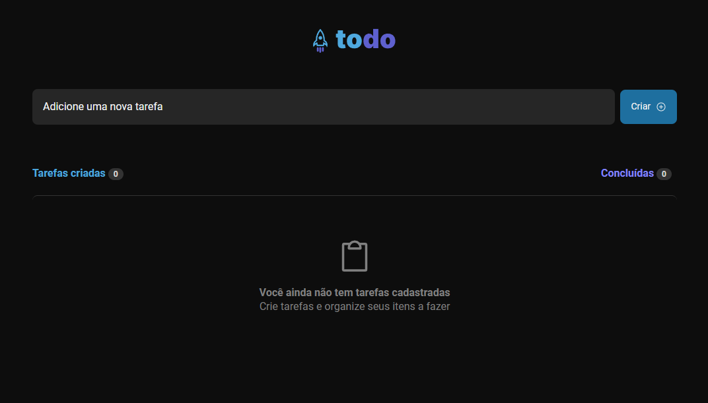
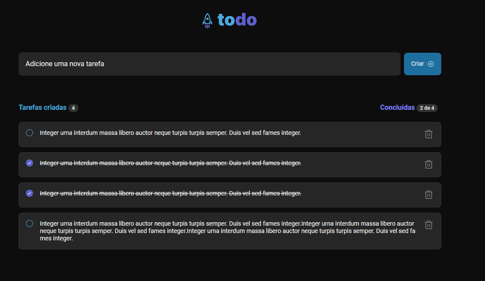

<h2 align="center">
  
  
  
  
</h2>

<h1 align="center">
  
</h1>

## 📌 Index

- [About](#-about)
- [Screenshots](#-screenshots)
- [Techs](#-techs)
- [Layout](#-layout)
- [License](#-license)

## ❔ About

Just a To-do page.

## 📸 Screenshots

<h1 align="center">
  
  
</h1>

## 🛠 Techs

This project was developed using the following technologies:

- [TypeScript](https://www.typescriptlang.org/)
- [React](https://pt-br.reactjs.org/)
- [Vite](https://vitejs.dev/)

---

## 🌅 Layout

- [Figma](https://www.figma.com/file/0n0zDN7zbzhRbaEO74Xesx/ToDo-List/duplicate)

---

## 📜 License

O projeto está sobre a licença [MIT](./LICENSE)

---

